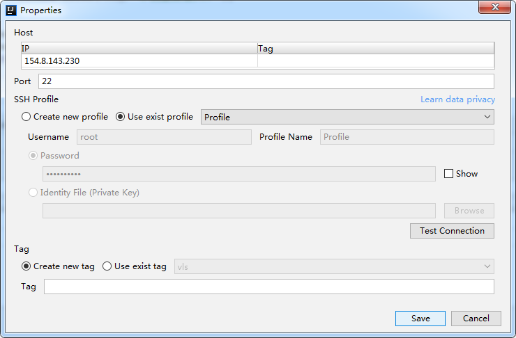
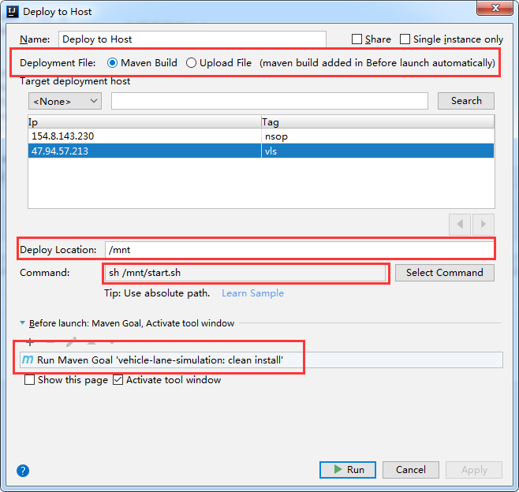

# Alibaba Cloud Toolkit 使用

## 参考网站和命令配置

1、参考网站

[https://www.aliyun.com/product/cloudtoolkit](https://www.aliyun.com/product/cloudtoolkit)

2、部署Spring boot项目命令

```shell
#!/bin/bash
source /etc/profile
killall vehicle-lane-simulation-0.0.1-SNAPSHOT.jar
nohup java -jar /mnt/vehicle-lane-simulation-0.0.1-SNAPSHOT.jar > nohup.log 2>&1 &
```

## idea 配置



