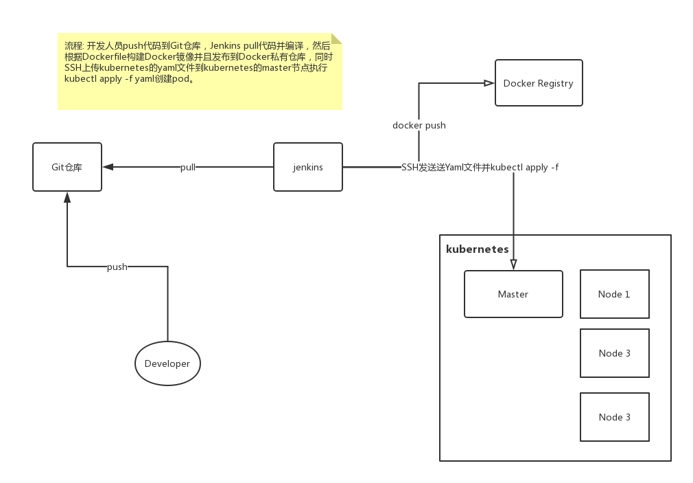

## 容器本质

### 容器兴起

* 容器技术的兴起源于 PaaS 技术的普及；
* Docker 公司发布的 Docker 项目具有里程碑式的意义;
* Docker 项目通过“容器镜像”，解决了应用打包这个根本性难题。

### 容器的价值

> 容器本身没有价值，有价值的是“容器编排”。

### 容器是什么

​	容器其实是一种沙盒技术。顾名思义，沙盒就是能够像一个集装箱一样，把你的应用“装”起来的技术。这样，应用与应用之间，就因为有了边界而不至于相互干扰；而被装进集装箱的应用，也可以被方便地搬来搬去，这不就是 PaaS 最理想的状态嘛。

​	不过，这两个能力说起来简单，但要用技术手段去实现它们，可能大多数人就无从下手了。

**容器技术的核心功能，就是通过约束和修改进程的动态表现，从而为其创造出一个“边界”。**

对于 Docker 等大多数 Linux 容器来说，`Cgroups 技术`是用来制造约束的主要手段，而`Namespace 技术`则是用来修改进程视图的主要方法。

#### Linux的Namespace

`namespace`其实是把新创建的Linux进程和宿主机已有的进程进行隔离，如果我们打开一个Docker容器在里面执行`ps`指令我们会看到我们在Docker容器中的进程数量是2，而宿主机中的进程我们是看不到的，这就是namespace起到的隔离作用。

```shell
/ # ps
PID   USER     TIME  COMMAND
    1 root      0:00 /bin/sh
    5 root      0:00 ps
```

namespace在Linux中的使用也很有趣，它其实就是创建进程的一个参数：

```shell
int pid = clone(main_function, stack_size, SIGCHLD, NULL); 
int pid = clone(main_function, stack_size, CLONE_NEWPID | SIGCHLD, NULL); 
```

我们用 clone() 系统调用创建一个新进程时，就可以在参数中指定`CLONE_NEWPID`参数，这时，新创建的这个进程将会“看到”一个全新的进程空间，在这个进程空间里，它的 PID 是 1。之所以说“看到”，是因为这只是一个“障眼法”，在宿主机真实的进程空间里，这个进程的 PID 还是真实的数值，比如 100。

**除了我们刚刚用到的 PID Namespace，Linux 操作系统还提供了 Mount、UTS、IPC、Network 和 User 这些 Namespace，用来对各种不同的进程上下文进行“障眼法”操作。**

比如，Mount Namespace，用于让被隔离进程只看到当前 Namespace 里的挂载点信息；Network Namespace，用于让被隔离进程看到当前 Namespace 里的网络设备和配置。

**这，就是 Linux 容器最基本的实现原理了。**

​	所以，Docker 容器这个听起来玄而又玄的概念，实际上是在创建容器进程时，指定了这个进程所需要启用的一组 Namespace 参数。这样，容器就只能“看”到当前 Namespace 所限定的资源、文件、设备、状态，或者配置。而对于宿主机以及其他不相关的程序，它就完全看不到了。

**所以说，容器，其实是一种特殊的进程而已。**


#### Linux的Cgroups

Linux Cgroups 就是 Linux 内核中用来为进程设置资源限制的一个重要功能，Linux Cgroups 的全称是 Linux Control Group。它最主要的作用，就是限制一个进程组能够使用的资源上限，包括 CPU、内存、磁盘、网络带宽等等。

#### Linux的rootfs

在容器中rootfs用来切换进程的根目录。需要明确的是，rootfs 只是一个操作系统所包含的文件、配置和目录，并不包括操作系统内核。在 Linux 操作系统中，这两部分是分开存放的，操作系统只有在开机启动时才会加载指定版本的内核镜像。

由于 rootfs 里打包的不只是应用，而是整个操作系统的文件和目录，也就意味着，应用以及它运行所需要的所有依赖，都被封装在了一起。

#### 总结

* Linux Namespace 的隔离能力。
* Linux Cgroups 的限制能力。
* 基于 rootfs 的文件系统。

## 容器编排

​	从一个开发者和单一的容器镜像，到无数开发者和庞大的容器集群，容器技术实现了从“容器”到“容器云”的飞跃，标志着它真正得到了市场和生态的认可。这样，容器就从一个开发者手里的小工具，一跃成为了云计算领域的绝对主角；而能够定义容器组织和管理规范的“容器编排”技术，则当仁不让地坐上了容器技术领域的“头把交椅”。这其中，最具代表性的容器编排工具，当属 Docker 公司的 Compose+Swarm 组合，以及 Google 与 RedHat 公司共同主导的 Kubernetes 项目。

​	我在前面介绍容器技术发展历史的四篇预习文章中，已经对这两个开源项目做了详细地剖析和评述。所以，在今天的这次分享中，我会专注于本专栏的主角 Kubernetes 项目，谈一谈它的设计与架构。

跟很多基础设施领域先有工程实践、后有方法论的发展路线不同，Kubernetes 项目的理论基础则要比工程实践走得靠前得多，这当然要归功于 Google 公司在 2015 年 4 月发布的 Borg 论文了。

Borg 系统，一直以来都被誉为 Google 公司内部最强大的“秘密武器”。虽然略显夸张，但这个说法倒不算是吹牛。

因为，相比于 Spanner、BigTable 等相对上层的项目，Borg 要承担的责任，是承载 Google 公司整个基础设施的核心依赖。在 Google 公司已经公开发表的基础设施体系论文中，Borg 项目当仁不让地位居整个基础设施技术栈的最底层。	


## 什么是kubernetes

​	首先，Kubernetes 项目要解决的问题是什么？

​	编排？调度？容器云？还是集群管理？

实际上，这个问题到目前为止都没有固定的答案。因为在不同的发展阶段，Kubernetes 需要着重解决的问题是不同的。

但是，对于大多数用户来说，他们希望 Kubernetes 项目带来的体验是确定的：现在我有了应用的容器镜像，请帮我在一个给定的集群上把这个应用运行起来。	

更进一步地说，我还希望 Kubernetes 能给我提供路由网关、水平扩展、监控、备份、灾难恢复等一系列运维能力。

等一下，这些功能听起来好像有些耳熟？这不就是经典 PaaS（比如，Cloud Foundry）项目的能力吗？

而且，有了 Docker 之后，我根本不需要什么 Kubernetes、PaaS，只要使用 Docker 公司的 Compose+Swarm 项目，就完全可以很方便地 DIY 出这些功能了！

所以说，如果 Kubernetes 项目只是停留在拉取用户镜像、运行容器，以及提供常见的运维功能的话，那么别说跟“原生”的 Docker Swarm 项目竞争了，哪怕跟经典的 PaaS 项目相比也难有什么优势可言。

而实际上，在定义核心功能的过程中，Kubernetes 项目正是依托着 Borg 项目的理论优势，才在短短几个月内迅速站稳了脚跟，进而确定了一个如下图所示的全局架构：	


从一开始，Kubernetes 项目就没有像同时期的各种“容器云”项目那样，把 Docker 作为整个架构的核心，而仅仅把它作为最底层的一个容器运行时实现。

> 运行在大规模集群中的各种任务之间，实际上存在着各种各样的关系。这些关系的处理，才是作业编排和管理系统最困难的地方。

## kubernetes搭建

http://blog.v5cn.cn/2019/01/18/%E4%BD%BF%E7%94%A8kubeadm%E6%90%AD%E5%BB%BAkubernetes%E9%9B%86%E7%BE%A4/

## 现有部署架构


## 使用kubernetes后的部署架构

