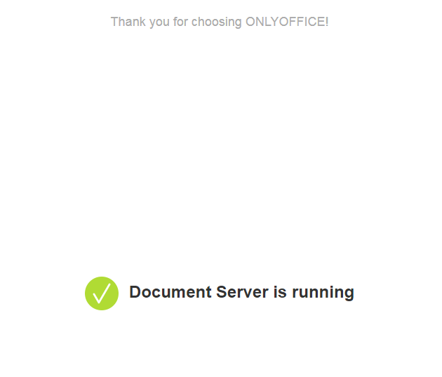
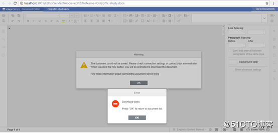
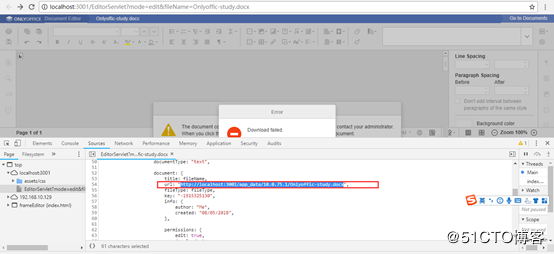

# Document Server服务安装

document-server服务使用docker安装相对比较简单

[官方docker镜像](https://hub.docker.com/r/onlyoffice/documentserver)

```bash
sudo docker run -i -t -d -p 7090:80 \
    -v /app/onlyoffice/DocumentServer/logs:/var/log/onlyoffice  \
    -v /app/onlyoffice/DocumentServer/data:/var/www/onlyoffice/Data  onlyoffice/documentserver
```

访问服务器当看到



说明搭建成功了

[官网网站](https://api.onlyoffice.com/editors/basic)

Document Server Editor汉化

[博客https://blog.csdn.net/hotqin888/article/details/79337881](https://blog.csdn.net/hotqin888/article/details/79337881)


# 官方java例子运行

官方java例子存在两个问题：

1. Document Server回调时会报错，错误是类转换异常，主因是回调的`JSON`中`status`转换为`int`类型是报错了，要转换成`long`类型。

2. `document.key`生成问题，例子中key的生成是文件路径+文件名，这样在文档编辑和保存后key不变，导致始终读取到的是历史版本的文档。

   官方建议：

   > Defines the unique document identifier used for document recognition by the service. In case the known key is sent the document will be taken from the cache. Every time the document is edited and saved, the key must be generated anew. The document url can be used as the **key** but without the special characters and the length is limited to 20 symbols.

   > 定义服务用于文档识别的唯一文档标识符。 如果发送已知密钥，文档将从缓存中获取。 每次文档被编辑和保存时，都必须重新生成密钥。 文档url可以用作密钥，但不包含特殊字符，长度限制为20个符号。（注意如果秘钥值不更换那么看到的文档还是最先加载的缓存文档）

# Document Editor参数使用

```javascript
docEditor = new DocsAPI.DocEditor("iframeEditor",
                {
                    width: "100%",
                    height: "100%",
                    type: "${type}",
                    documentType: "<%= Model.GetDocumentType() %>",
                    document: {
                        title: fileName,
                        url: "<%= Model.GetFileUri() %>",
                        fileType: fileType,
                        key: "<%= Model.GetKey() %>",
                        info: {
                            author: "Me",
                            created: "<%= new SimpleDateFormat("MM/dd/yyyy").format(new Date()) %>",
                        },
                        permissions: {
                            edit: <%= Boolean.toString(DocumentManager.GetEditedExts().contains(FileUtility.GetFileExtension(Model.GetFileName()))).toLowerCase() %>,
                            download: true,
                        }
                    },
                    editorConfig: {
                        mode: "<%= DocumentManager.GetEditedExts().contains(FileUtility.GetFileExtension(Model.GetFileName())) && !"view".equals(request.getAttribute("mode")) ? "edit" : "view" %>",
                        lang: "en",
                        callbackUrl: "<%= Model.GetCallbackUrl() %>",
                        user: {
                            id: "<%= Model.CurUserHostAddress() %>",
                            name: "John Smith",
                        },
                        embedded: {
                            saveUrl: "<%= Model.GetFileUri() %>",
                            embedUrl: "<%= Model.GetFileUri() %>",
                            shareUrl: "<%= Model.GetFileUri() %>",
                            toolbarDocked: "top",
                        },
                        customization: {
                            about: true,
                            feedback: true,
                            goback: {
                                url: "<%= Model.GetServerUrl() %>/IndexServlet",
                            },
                        },
                    },
                    events: {
                        "onReady": onReady,
                        "onDocumentStateChange": onDocumentStateChange,
                        'onRequestEditRights': onRequestEditRights,
                        "onError": onError,
                        "onOutdatedVersion": onOutdatedVersion,
                    }
                });
        };	
```

| 字段         | 解释                                                         | 例子                    |
| ------------ | ------------------------------------------------------------ | ----------------------- |
| fileType     | 定义源查看或编辑文档的文件类型                               | String “docx”           |
| key          | 定义服务用于文档识别的唯一文档标识符。 如果发送已知密钥，文档将从缓存中获取。 每次文档被编辑和保存时，都必须重新生成密钥。 文档url可以用作密钥，但不包含特殊字符，长度限制为20个符号。（注意如果秘钥值不更换那么看到的文档还是最先加载的缓存文档） | String "Khirz6zTPdfd7"  |
| title        | 为查看或编辑的文档定义所需的文件名，当文档被下载时它也将被用作文件名。 | String "testTitle.docx" |
| url          | 定义存储源查看或编辑文档的绝对URL(文件存储服务的URL,Document Server可以下载到文件) |                         |
| documentType | 文件编辑类型，根据文件的类型在客户端用不通的编辑器来编辑文件主要三种 文档类-text、表格类-spreadsheet、ppt类-presentation | String  text            |
| callbackUrl  | 文件关闭后回调路劲 这个用来保存文件用的 文件编辑保存后 当你关闭窗口后 server端会请求把你在服务器上的编辑提交到这个路劲 ，所以这个路劲的代码 一般就是上传保存，自己构建的Document Server的回调地址，当编辑器关闭后10秒，Document Server会回调此地址，所以地址要Document Server能够访问到。 | String                  |

其中 document属性下的url地址 和 editorConfig属性下的callbackUrl地址十分重要，也是在开发中需要重点关注的地方，很多报出的以下错误基本都是地址不对导致的。

	

重点说说这两个配置的作用
1）. document属性下的url配置是onlyoffice的编辑服务用于获取文档的地址，也就是说，**我们必须保证在docker中是必须能访问到的地址**， 通过wget命令尝试在docker所在的服务器中是否能够访问。



2）.  editorConfig属性下的callbackUrl配置是onlyoffice的编辑服务回调的，该回调的作用是告知你编辑后文档的下载地址，以便更新原始文件，**所以我们也得保证docker能够访问到该地址**。我们可以自己编写个用于回调的方法。


