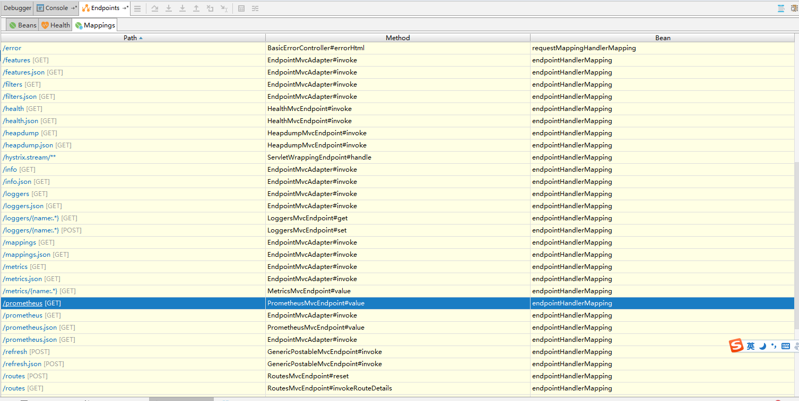
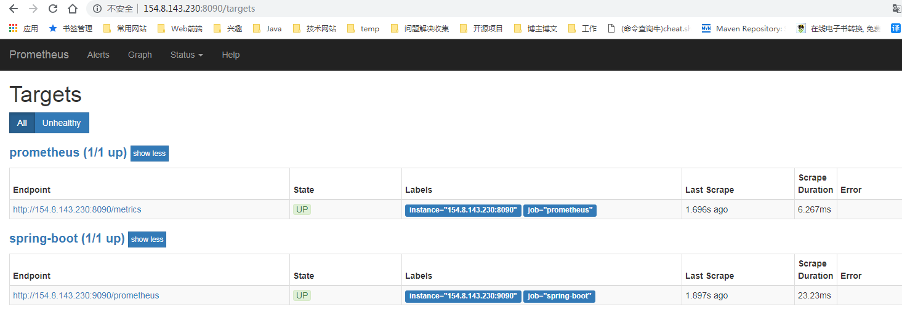
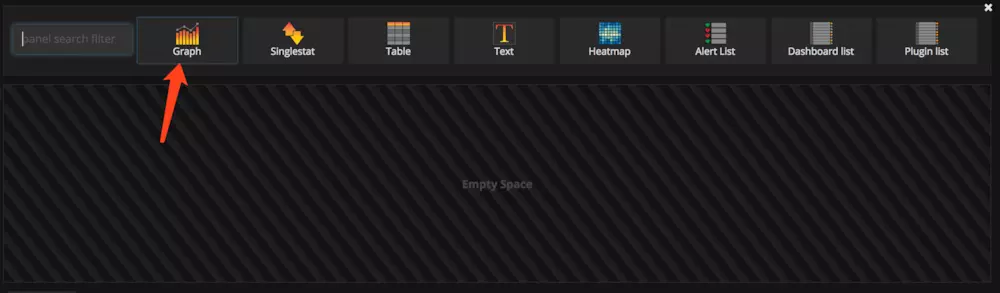
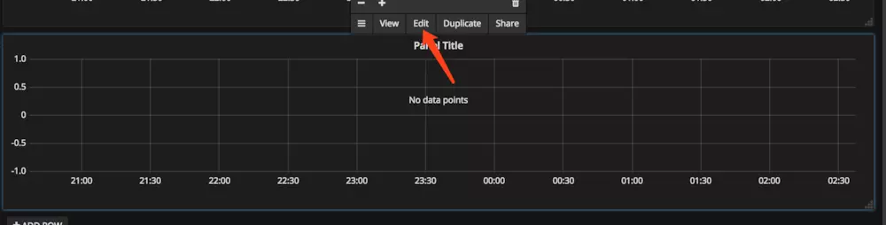
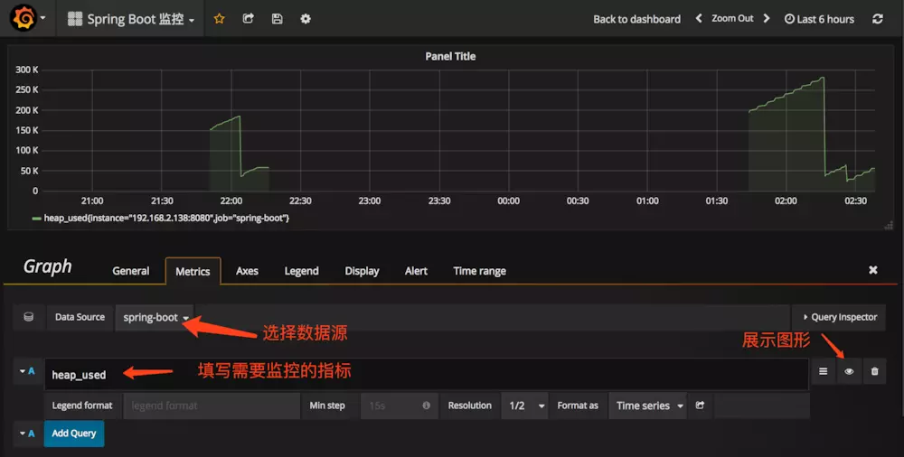
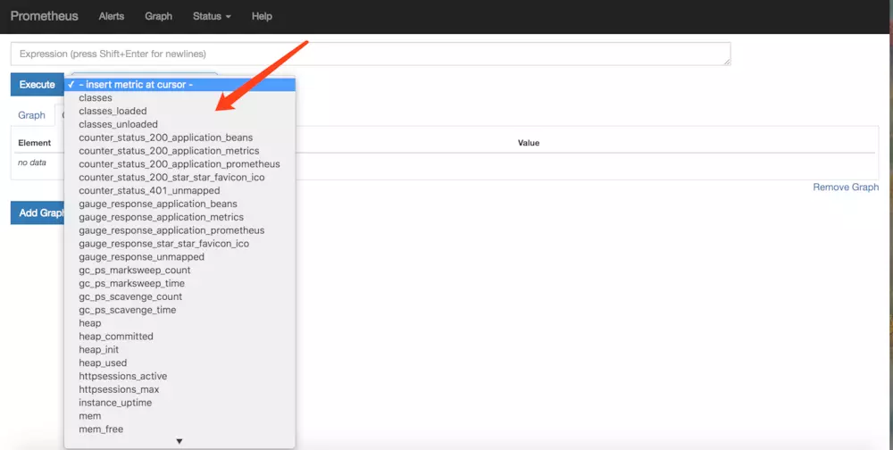
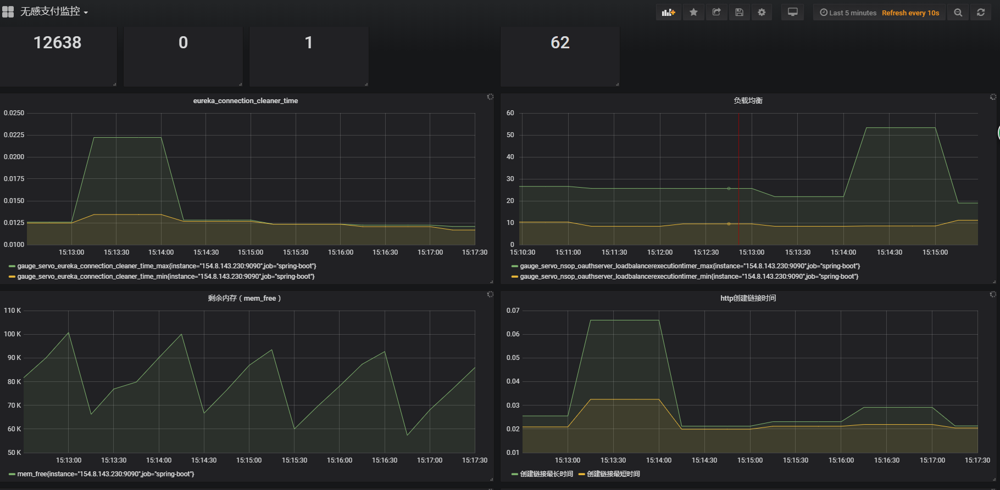

# Docker安装Grafana

```shell
docker run -d --name=grafana -p 3000:3000 grafana/grafana
```

默认用户名密码admin/admin

# Docker安装Prometheus

```shell
docker pull prom/prometheus
```

```shell
docker run -d \
  -p 8090:9090 \
  -v /root/prometheus.yml:/usr/local/src/file/prometheus.yml \
  prom/prometheus \
  --config.file=/usr/local/src/file/prometheus.yml
```

# 项目集成Prometheus

```xml
<dependency>
    <groupId>org.springframework.boot</groupId>
    <artifactId>spring-boot-starter-actuator</artifactId>
</dependency>

<dependency>
    <groupId>io.prometheus</groupId>
    <artifactId>simpleclient_spring_boot</artifactId>
    <version>0.6.0</version>
</dependency>
```

然后，在启动类 `Application.java` 添加如下注解：

```java
@SpringBootApplication
@EnablePrometheusEndpoint
@EnableSpringBootMetricsCollector
public class Application {

    public static void main(String[] args) {
        SpringApplication.run(Application.class, args);
    }

}
```

最后，配置默认的登录账号和密码，在 `application.yml` 中：

```yaml
security:
  user:
    name: zhangsan
    password: 000000
```

> 提示：不建议配置 `management.security.enabled: false`

启动应用程序后，会看到如下一系列的 `Mappings`

​	

然后，编写配置文件 `prometheus.yml`

```yaml
scrape_configs:
  - job_name: spring-boot
    scrape_interval: 5s
    scrape_timeout: 5s
    metrics_path: /prometheus
    scheme: http
    basic_auth:
      username: zhangsan
      password: 000000
    static_configs:
      - targets:
        - 127.0.0.1:8080  #此处填写 Spring Boot 应用的 IP + 端口号
```

最后，访问Prometheus地址端口 , 检查 Spring Boot 采集状态是否正常。



# Grafana 可视化监控数据配置

> Grafana 登录账号 admin 密码 admin

1、配置单个指标的可视化监控面板：








> 提示，此处不能任意填写，只能填已有的指标点，具体的可以在 Prometheus 的首页看到，即 [http://localhost:9090/graph](https://link.jianshu.com/?t=http://localhost:9090/graph)



多配置几个指标之后，即可有如下效果：



参考网站

https://www.jianshu.com/p/7ecb57a3f326


# 发送数据到Prometheus

生成数据供Prometheus使用有两种方法

1. 配置`micrometer-registry-prometheus`

   ```xml
   <dependency>
     <groupId>org.springframework.boot</groupId>
     <artifactId>spring-boot-starter-actuator</artifactId>
   </dependency>
   
   <dependency>
     <groupId>io.micrometer</groupId>
     <artifactId>micrometer-registry-prometheus</artifactId>
     <version>${micrometer.version}</version>
   </dependency>
   
   <dependency>
     <groupId>io.micrometer</groupId>
     <artifactId>micrometer-spring-legacy</artifactId>
     <version>${micrometer.version}</version>
   </dependency>
   ```

   这个库是http://micrometer.io/docs/registry/prometheus提供的

2. 配置`simpleclient_spring_boot`

   这个库是prometheus官方提供的

   ```xml
   <dependency>
     <groupId>org.springframework.boot</groupId>
     <artifactId>spring-boot-starter-actuator</artifactId>
   </dependency>
   
   <dependency>
       <groupId>io.prometheus</groupId>
       <artifactId>simpleclient_spring_boot</artifactId>
       <version>0.6.0</version>
   </dependency>
   ```

两个库都可以提供暴露数据给prometheus https://github.com/prometheus/client_java

## 参考

1、https://blog.csdn.net/liufei198613/article/details/82460883 介绍micrometer-registry-prometheus

2、https://blog.csdn.net/zl1zl2zl3/article/details/75045005 介绍simpleclient_spring_boot