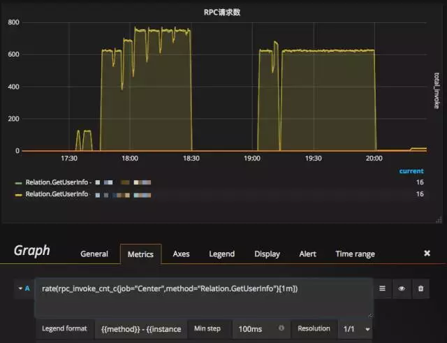
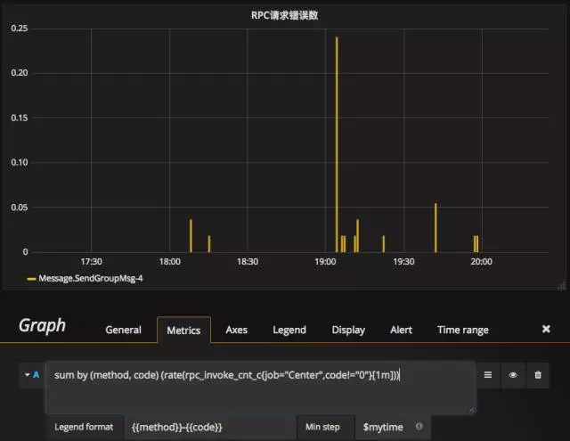
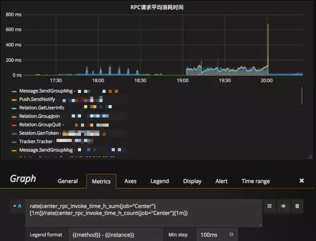

## 统计指标

### Counter

`Counter`表示收集的数据是按照某个趋势（增加／减少）一直变化的。

使用`Counter`的场景主要有接口请求次数、消息队列数量、重试操作次数等。比较推荐多使用`Counter`类型采集，因为`Counter`类型不会在两次采集间隔中间丢失信息。

### Gange

`Gauge`表示搜集的数据是瞬时的，可以任意变高变低。

使用`Gange`的场景：记录内存使用率、磁盘使用率、在线人数、协议流量、包大小等。`Gauge`模式比较适合记录无规律变化的数据，而且两次采集之间可能会丢失某些数值变化的情况。随着时间周期的粒度变大，丢失关键变化的情况也会增多。

### Histogran

`Histogram`可以理解为直方图，主要用于表示一段时间范围内对数据进行采样，（通常是请求持续时间或响应大小），并能够对其指定区间以及总数进行统计。

`Histogram` 由 `<basename>_bucket{le="<upper inclusive bound>"}`，`<basename>_bucket{le="+Inf"}`, `<basename>_sum`，`<basename>_count` 组成

### Summary

`Summary`和`Histogram`十分相似，主要用于表示一段时间范围内对数据进行采样，（通常是请求持续时间或响应大小），它直接存储了 `quantile` 数据，而不是根据统计区间计算出来的。

使用`Histogram`和`Summary`的场景用于统计平均延迟、请求延迟占比和分布率。另外针对`Histogram`，不论是打点还是查询对服务器的CPU消耗比较高，通过查询时查询结果的返回耗时会有十分直观的感受。

由 `<basename>{quantile="<φ>"}`，`<basename>_sum`，`<basename>_count`组成。它直接存储了 `quantile` 数据，而不是根据统计区间计算出来的。

### Histogram vs Summary

- 都包含 `<basename>_sum`，`<basename>_count`
- Histogram 需要通过 `<basename>_bucket` 计算 quantile, 而 Summary 直接存储了 quantile 的值。

## prometheus采集数据结构

`prometheus`的每条时序数据都是由 `metric`（指标名称），一个或一组`label`（标签），以及`float64`的值组成的。

标准格式为 <metric name>{<label name>=<label value>,...}，如下图：


jvm的采集数据：

```
	# HELP jvm_memory_used_bytes The amount of used memory
# TYPE jvm_memory_used_bytes gauge
jvm_memory_used_bytes{application="nsop-gateway",area="nonheap",id="Compressed Class Space",} 7988792.0
jvm_memory_used_bytes{application="nsop-gateway",area="heap",id="PS Eden Space",} 2.66193976E8
jvm_memory_used_bytes{application="nsop-gateway",area="nonheap",id="Code Cache",} 1.3924736E7
jvm_memory_used_bytes{application="nsop-gateway",area="heap",id="PS Old Gen",} 3.0202E7
jvm_memory_used_bytes{application="nsop-gateway",area="heap",id="PS Survivor Space",} 2.254436E7
jvm_memory_used_bytes{application="nsop-gateway",area="nonheap",id="Metaspace",} 5.9092648E7
# HELP jvm_memory_max_bytes The maximum amount of memory in bytes that can be used for memory management
# TYPE jvm_memory_max_bytes gauge
jvm_memory_max_bytes{application="nsop-gateway",area="nonheap",id="Compressed Class Space",} 1.073741824E9
jvm_memory_max_bytes{application="nsop-gateway",area="heap",id="PS Eden Space",} 1.370488832E9
jvm_memory_max_bytes{application="nsop-gateway",area="nonheap",id="Code Cache",} 2.5165824E8
jvm_memory_max_bytes{application="nsop-gateway",area="heap",id="PS Old Gen",} 2.843738112E9
jvm_memory_max_bytes{application="nsop-gateway",area="heap",id="PS Survivor Space",} 2.2544384E7
jvm_memory_max_bytes{application="nsop-gateway",area="nonheap",id="Metaspace",} -1.0
```

有了数据我们就可以使用`Prometheus`强大的查询语言`PromQL`进行极为复杂的查询。

## PromQL

`PromQL`(Prometheus Query Language) 是 Prometheus 自己开发的数据查询 DSL 语言，语言表现力非常丰富，支持条件查询、操作符，并且内建了大量内置函，供我们针对监控数据的各种维度进行查询。

### PromQL的查询结果类型

PromQL 查询结果主要有 3 种类型：

- 瞬时数据 (Instant vector): 包含一组时序，每个时序只有一个点，例如：`http_requests_total`
- 区间数据 (Range vector): 包含一组时序，每个时序有多个点，例如：`http_requests_total[5m]`
- 纯量数据 (Scalar): 纯量只有一个数字，没有时序，例如：`count(http_requests_total)`

### 查询条件

Prometheus 存储的是时序数据，而它的时序是由名字和一组标签构成的，其实名字也可以写出标签的形式，例如 `http_requests_total` 等价于 {**name**="http_requests_total"}。

一个简单的查询相当于是对各种标签的筛选，例如：

```
http_requests_total{code="200"} // 表示查询名字为 http_requests_total，code 为 "200" 的数据
```

查询条件支持正则匹配，例如：

```
http_requests_total{code!="200"}  // 表示查询 code 不为 "200" 的数据
http_requests_total{code=～"2.."} // 表示查询 code 为 "2xx" 的数据
http_requests_total{code!～"2.."} // 表示查询 code 不为 "2xx" 的数据
```

### 操作符

Prometheus 查询语句中，支持常见的各种表达式操作符，例如

**算术运算符**:

支持的算术运算符有 `+，-，*，/，%，^`, 例如 `http_requests_total * 2` 表示将 http_requests_total 所有数据 double 一倍。

**比较运算符**:

支持的比较运算符有 `==，!=，>，<，>=，<=`, 例如 `http_requests_total > 100` 表示 http_requests_total 结果中大于 100 的数据。

**逻辑运算符**:

支持的逻辑运算符有 `and，or，unless`, 例如 `http_requests_total == 5 or http_requests_total == 2` 表示 http_requests_total 结果中等于 5 或者 2 的数据。

**聚合运算符**:

支持的聚合运算符有 `sum，min，max，avg，stddev，stdvar，count，count_values，bottomk，topk，quantile，`, 例如 `max(http_requests_total)` 表示 http_requests_total 结果中最大的数据。

注意，和四则运算类型，Prometheus 的运算符也有优先级，它们遵从（^）> (*, /, %) > (+, -) > (==, !=, <=, <, >=, >) > (and, unless) > (or) 的原则。

### 内置函数

Prometheus 内置不少函数，方便查询以及数据格式化，例如将结果由浮点数转为整数的 floor 和 ceil，

```
floor(avg(http_requests_total{code="200"}))
ceil(avg(http_requests_total{code="200"}))
```

查看 http_requests_total 5分钟内，平均每秒数据

```
rate(http_requests_total[5m])
```

### 例子

我们想统计`Center`组件`Router.GetUserInfo`的频率，可使用如下Query语句：

```
rpc_invoke_cnt_c{code="0",method="Session.GenToken",job="Center"} 5
rpc_invoke_cnt_c{code="0",method="Relation.GetUserInfo",job="Center"} 12
rpc_invoke_cnt_c{code="0",method="Message.SendGroupMsg",job="Center"} 12
rpc_invoke_cnt_c{code="4",method="Message.SendGroupMsg",job="Center"} 3
rpc_invoke_cnt_c{code="0",method="Tracker.Tracker.Get",job="Center"} 70
```

**PromQL**

```
rate(rpc_invoke_cnt_c{method="Relation.GetUserInfo",job="Center"}[1m])
```



或者基于方法和错误码统计Center的整体RPC请求错误频率：

```
sum by (method, code)(rate(rpc_invoke_cnt_c{job="Center",code!="0"}[1m]))
```



如果我们想统计Center各方法的接口耗时，使用如下Query语句即可：

```
rate(rpc_invoke_time_h_sum{job="Center"}[1m]) / rate(rpc_invoke_time_h_count{job="Center"}[1m])
```



## 业界监控原则

在具体的监控指标规划上应遵循业界通用的 USE 原则和 RED 原则。

其中，USE 原则指的是，按照如下三个维度来规划资源监控指标：

1. 利用率（Utilization），资源被有效利用起来提供服务的平均时间占比；
2. 饱和度（Saturation），资源拥挤的程度，比如工作队列的长度；
3. 错误率（Errors），错误的数量。

而 RED 原则指的是，按照如下三个维度来规划服务监控指标：

1. 每秒请求数量（Rate）；
2. 每秒错误数量（Errors）；
3. 服务响应时间（Duration）。

## 参考和总结

https://mp.weixin.qq.com/s/lcjZzjptxrUBN1999k_rXw